# Numerical Tweener

Numerical Tweener - a set of the 31st mathematical method for smoothly animating a change in a numerical value. The set allows you to simplify the start of animation (tween) of any parameter represented as a floating point number (float), using two nodes: calling the animation manager (Tweener) and starting the animation (AddTween). When launching an animation, it is enough to indicate the variable by reference, the number by which it must change, the time by which it must change, the way of a smooth transition, the delay (if necessary) and bezier. All available nodes are listed in the ["Bluprints nodes"](#Blueprints-nodes) section.

## How To Use

TODO:

## Includes Eases

* Linear;

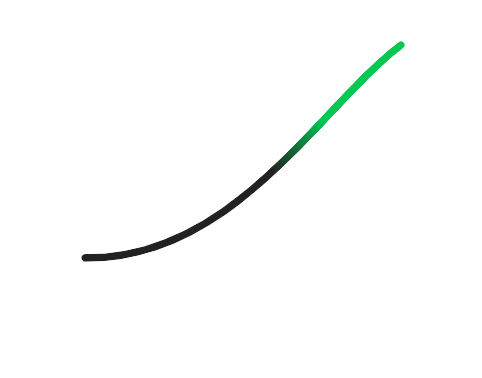
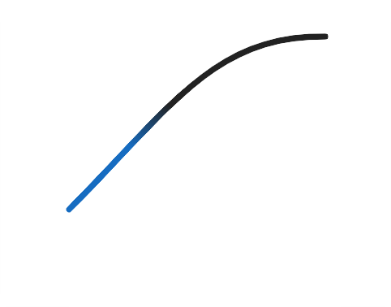

* EaseInSine;
* EaseOutSine;		
* EaseInOutSine;	

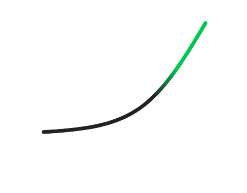
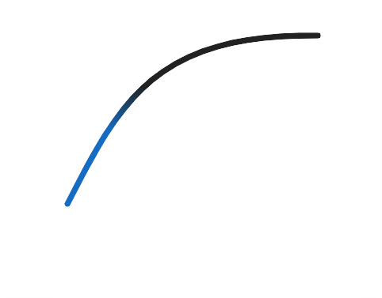
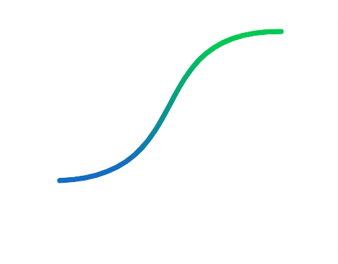

* EaseInCubic;		
* EaseOutCubic;	
* EaseInOutCubic;	

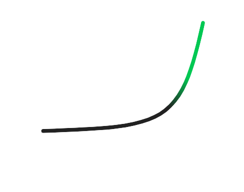
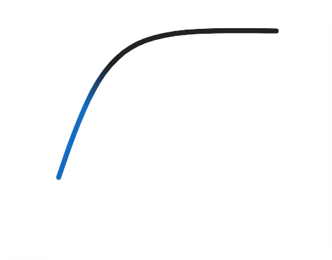

* EaseInQuint;		
* EaseOutQuint;	
* EaseInOutQuint;	

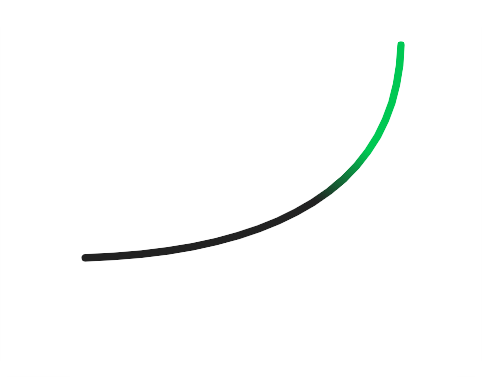
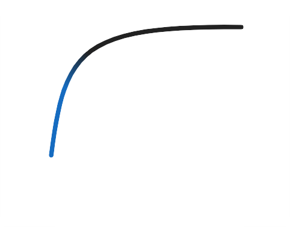
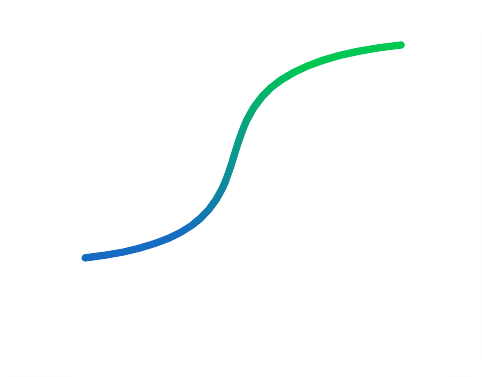

* EaseInCirc;		
* EaseOutCirc;		
* EaseInOutCirc;	

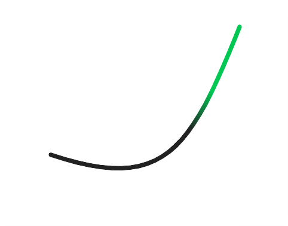
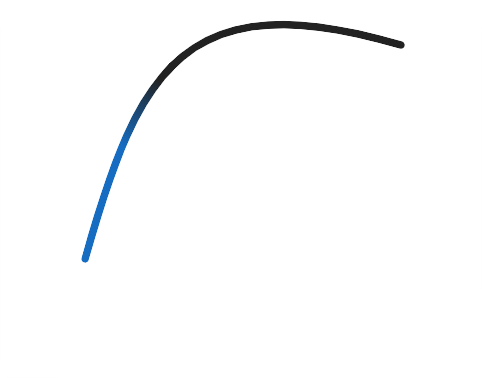
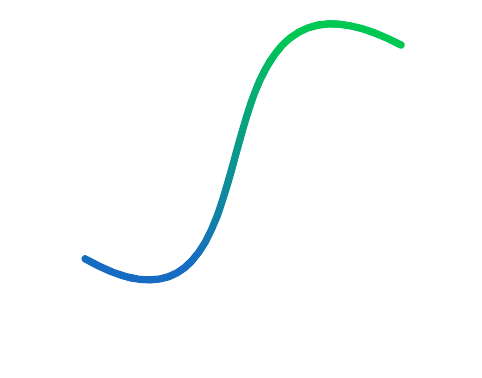

* EaseInBack;		
* EaseOutBack;		
* EaseInOutBack;	

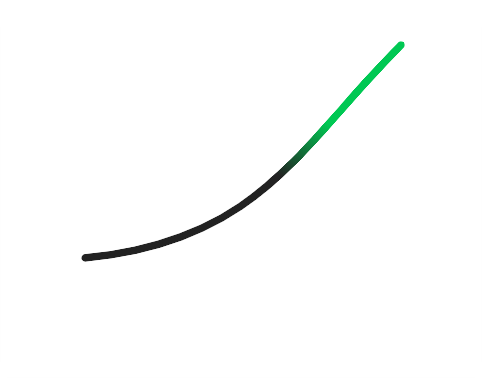
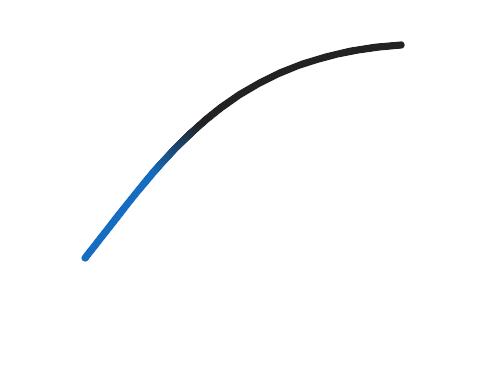
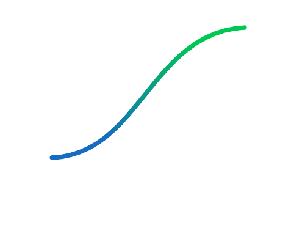

* EaseInQuad;		
* EaseOutQuad;		
* EaseInOutQuad;	

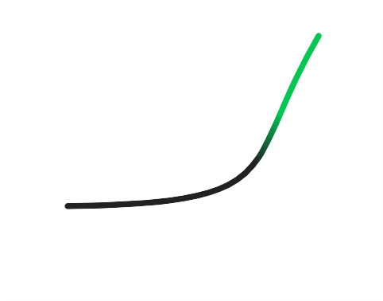
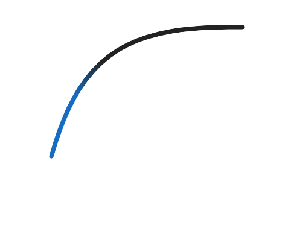
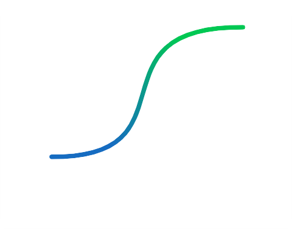

* EaseInQuart;		
* EaseOutQuart;	
* EaseInOutQuart;	

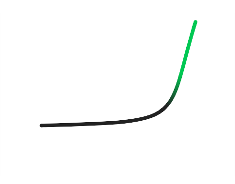
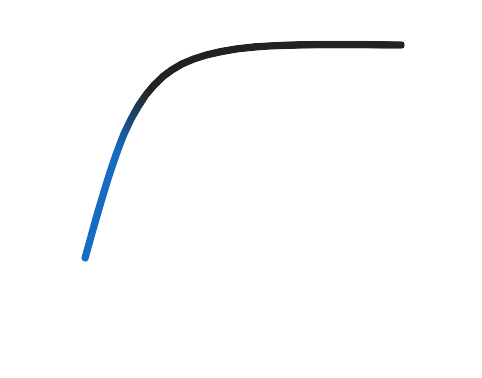
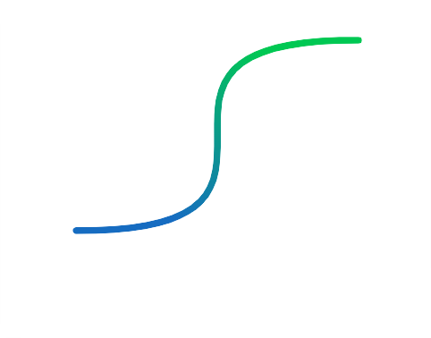

* EaseInExpo;		
* EaseOutExpo;		
* EaseInOutExpo;	

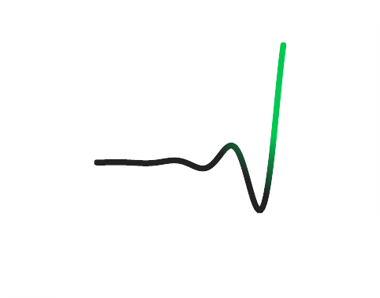
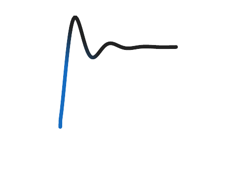
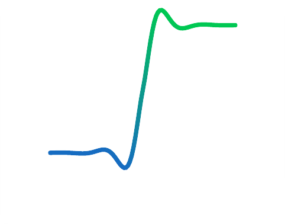

* EaseInElastic;	
* EaseOutElastic;	
* EaseInOutElastic;

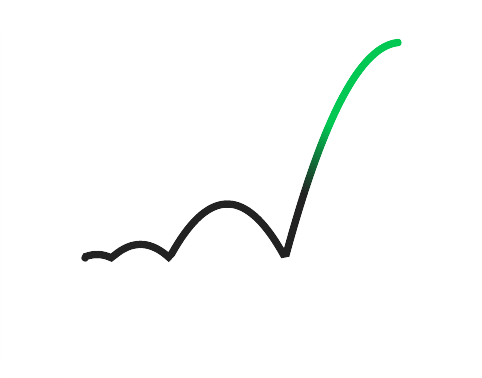
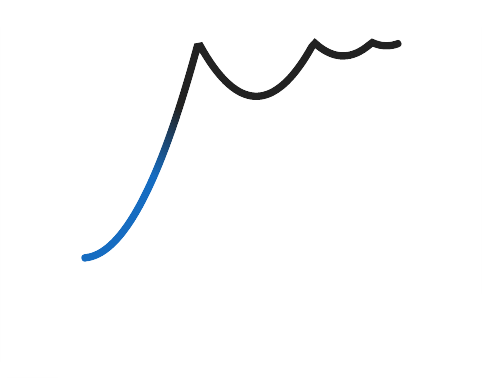

* EaseInBounce;	
* EaseOutBounce;	
* EaseInOutBounce;	

## Blueprints nodes

* Transitions:

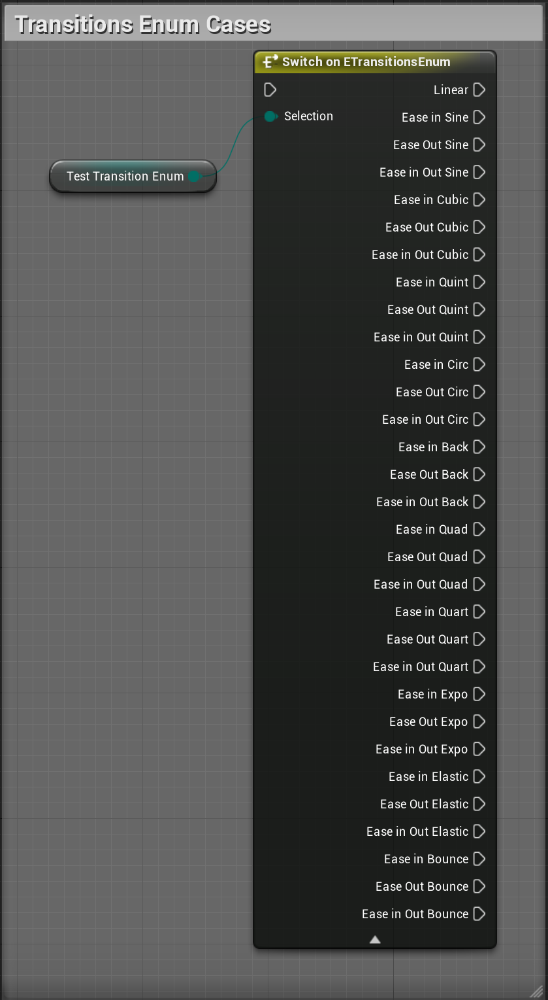

* Get tweens manager:

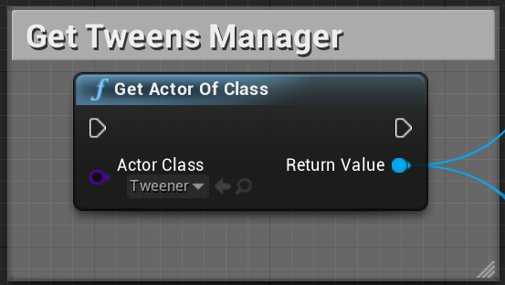

* Add tween:

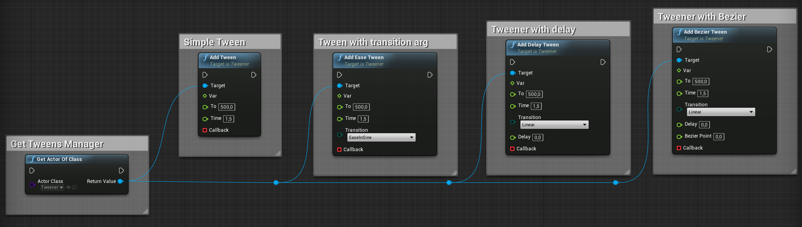

* Remove tweens:

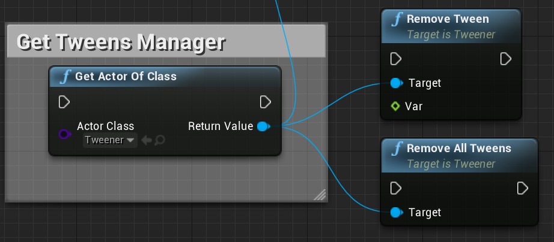

* Change Time scale for all added tweens:

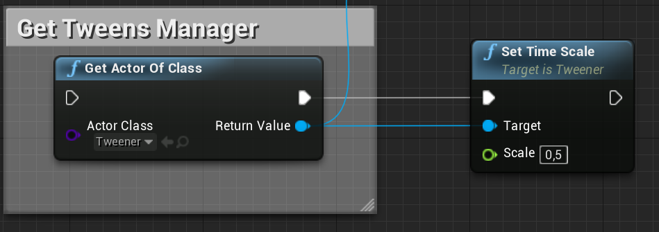