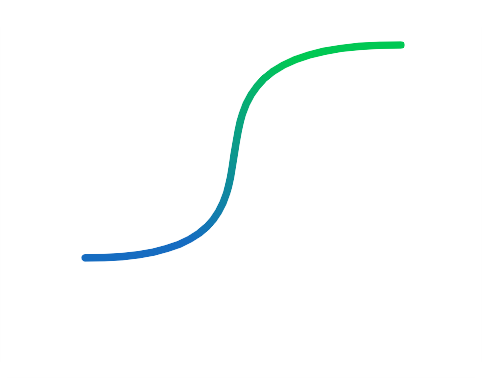
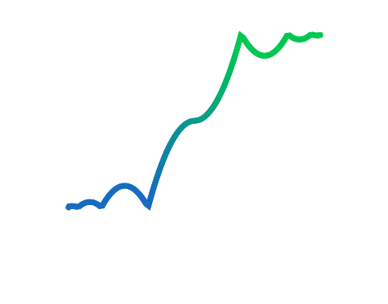

# Numerical Tweener

Numerical Tweener - набор из 31-го математического способа для плавного анимировния изменения численного значения. Набор позволяет упростить запуск анимации (tween) любого параметра, представленного в виде числа с плавающей точкой (float), с помощью двух нод: вызов менеджера анимации (Tweener) и запуск анимации (AddTween).

## Includes Eases

* Linear;

* EaseInSine;
* EaseOutSine;		
* EaseInOutSine;	

* EaseInCubic;		
* EaseOutCubic;	
* EaseInOutCubic;	

* EaseInQuint;		
* EaseOutQuint;	
* EaseInOutQuint;	

* EaseInCirc;		
* EaseOutCirc;		
* EaseInOutCirc;	

* EaseInBack;		
* EaseOutBack;		
* EaseInOutBack;	

* EaseInQuad;		
* EaseOutQuad;		
* EaseInOutQuad;	

* EaseInQuart;		
* EaseOutQuart;	
* EaseInOutQuart;	

* EaseInExpo;		
* EaseOutExpo;		
* EaseInOutExpo;	

* EaseInElastic;	
* EaseOutElastic;	
* EaseInOutElastic;

* EaseInBounce;	
* EaseOutBounce;	
* EaseInOutBounce;	

